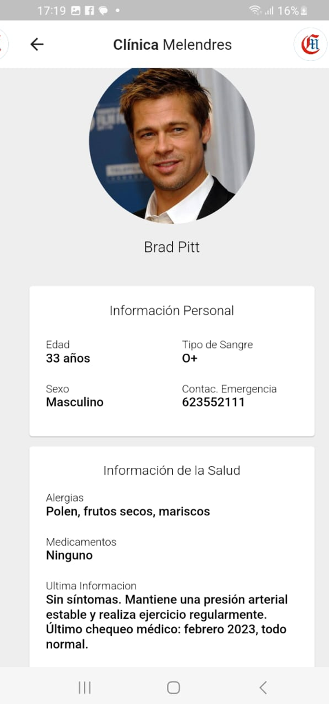

# Aplicación Móvil de Gestión de Emergencias

[English](./README.md) | [Español](./README.es.md) | [Français](./README.fr.md) | [日本語](./README.jp.md)

Esta es una aplicación móvil desarrollada con Flutter para gestionar información relacionada con emergencias en un entorno médico. La aplicación proporciona diversas funciones para facilitar la atención y seguimiento de pacientes en situaciones de emergencia.

## Características Principales

- **Gestión de Pacientes**: Permite el registro y la gestión de la información de los pacientes en el área de emergencias.

- **Registro de Personal Médico**: Gestiona la información sobre el personal médico, incluyendo roles y privilegios.

- **Reconocimiento Facial para Pacientes**: Captura fotos faciales de los pacientes para una identificación rápida y recuperación de datos.

- **Gestión de Emergencias**: Proporciona un módulo para gestionar emergencias entrantes con información detallada sobre la emergencia y el paciente.

- **Historias Clínicas Electrónicas**: Gestiona los registros de historias clínicas electrónicas de pacientes, tanto asegurados como nuevos.

## Requisitos de Instalación

- Flutter SDK: Necesitas tener instalado Flutter SDK.
- Ejecuta `flutter pub get` para instalar las dependencias necesarias.

## Instrucciones de Uso

1. Clona o descarga el repositorio.
2. Abre el proyecto en un IDE compatible con Flutter.
3. Conecta un dispositivo móvil o inicia un emulador.
4. Ejecuta `flutter run` para compilar y lanzar la aplicación en el dispositivo/emulador.

## Screenshots

| **Dashboard** | **Gestión de Usuarios** | **Formulario de Usuario** |
|:-------------------:|:--------------------------:|:----------------:|
|  |  |  |

| **Pantalla de Perfil** | **Información de Emergencia** | **Identificación Facial** |
|:-----------------------:|:---------------------------------:|:--------------------------------------:|
|  |  |  |

| **Historial Médico 1** | **Historial Médico 2** |
|:-----------------------:|:-----------------------:|
|  |  |

## Contribuciones

- Haz un fork del repositorio.
- Crea una nueva rama para tus cambios.
- Realiza los cambios y commits necesarios.
- Envía una pull request con tus cambios propuestos.
