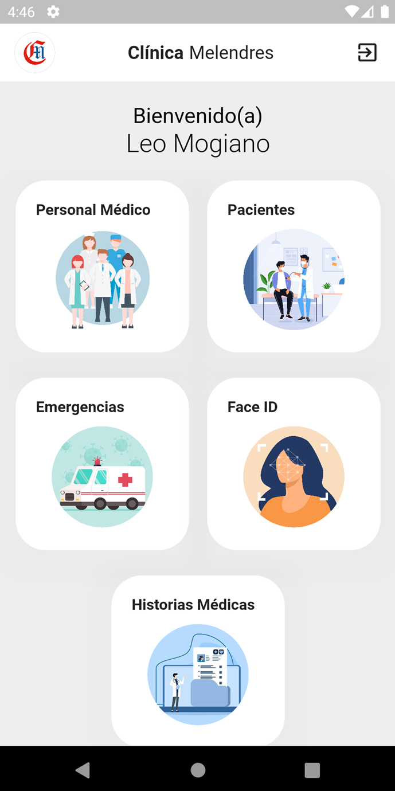
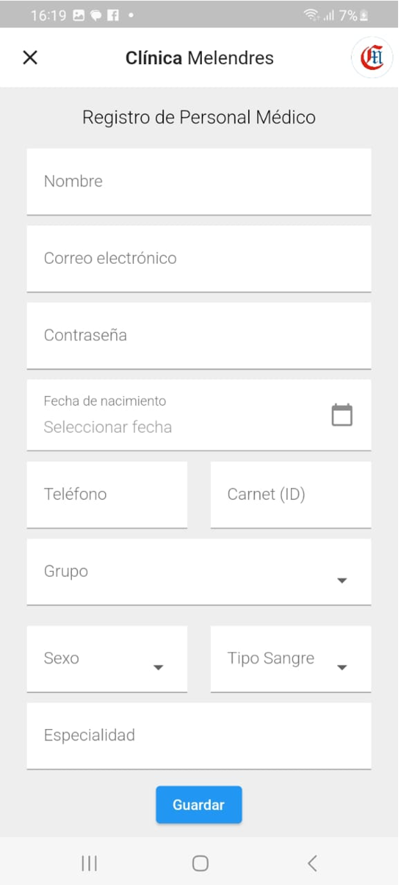
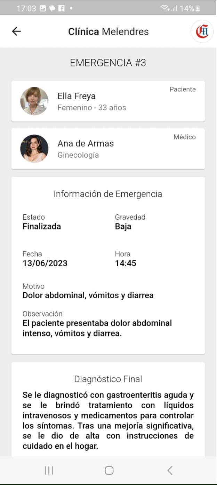
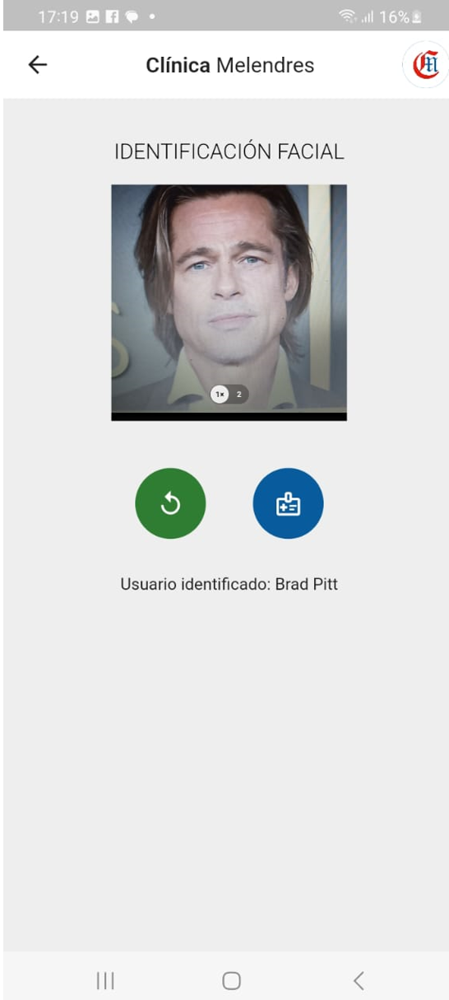

# Application Mobile de Gestion des Urgences

[English](./README.md) | [Español](./README.es.md) | [Français](./README.fr.md) | [日本語](./README.jp.md)

Il s'agit d'une application mobile développée avec Flutter pour gérer les informations liées aux urgences dans un contexte médical. L'application propose différentes fonctionnalités pour faciliter les soins aux patients et le suivi dans des situations d'urgence.

## Fonctionnalités Clés

- **Gestion des Patients**: Permet l'enregistrement et la gestion des informations des patients dans la zone d'urgence.

- **Enregistrement du Personnel Médical**: Gère les informations sur le personnel médical, y compris les rôles et les privilèges.

- **Reconnaissance Faciale pour les Patients**: Capture des photos faciales des patients pour une identification rapide et la récupération de données.

- **Gestion des Urgences**:  Fournit un module pour gérer les urgences entrantes avec des informations détaillées sur l'urgence et le patient.

- **Dossiers Médicaux Électroniques**: Gère les dossiers médicaux électroniques des patients, qu'ils soient assurés ou nouveaux.

## Exigences d'Installation

- Flutter SDK : Vous devez avoir le Flutter SDK installé.
- Exécutez `flutter pub get` pour installer les dépendances nécessaires.

## Instructions d'Utilisation

1. Clonez ou téléchargez le dépôt.
2. Ouvrez le projet dans un IDE compatible avec Flutter.
3. Connectez un appareil mobile ou lancez un émulateur.
4. Exécutez `flutter run` pour compiler et lancer l'application sur l'appareil/émulateur.

## Captures d'Écran

| **Dashboard** | **Gestion des Utilisateurs** | **Formulaire Utilisateur** |
|:-------------------:|:--------------------------:|:----------------:|
|  |  |  |

| **Écran de Profi** | **Informations sur l'Urgence** | **Identification Faciale** |
|:-----------------------:|:---------------------------------:|:--------------------------------------:|
|  |  |  |

| **Historique Médical 1** | **Historique Médical 2** |
|:-----------------------:|:-----------------------:|
|  |  |

## Contributions

- Fork du dépôt.
- Créez une nouvelle branche pour vos modifications.
- Effectuez les changements nécessaires et les commits.
- Soumettez une pull request avec vos modifications proposées.
