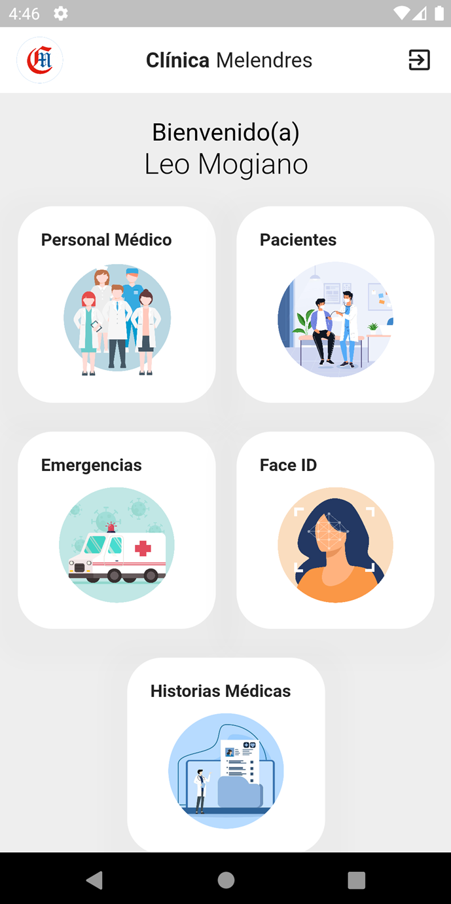
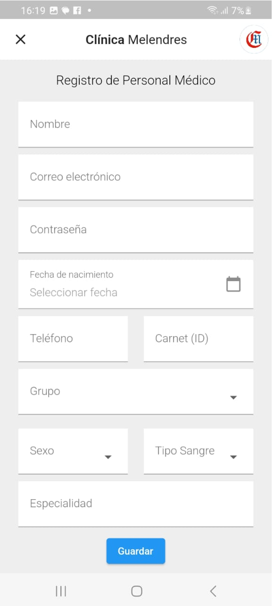
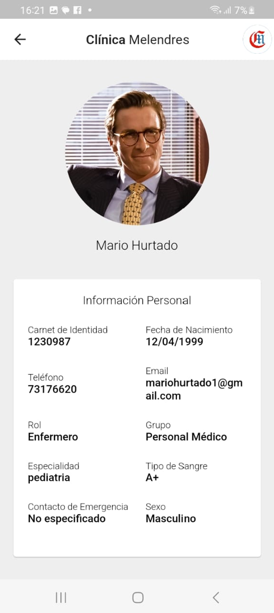
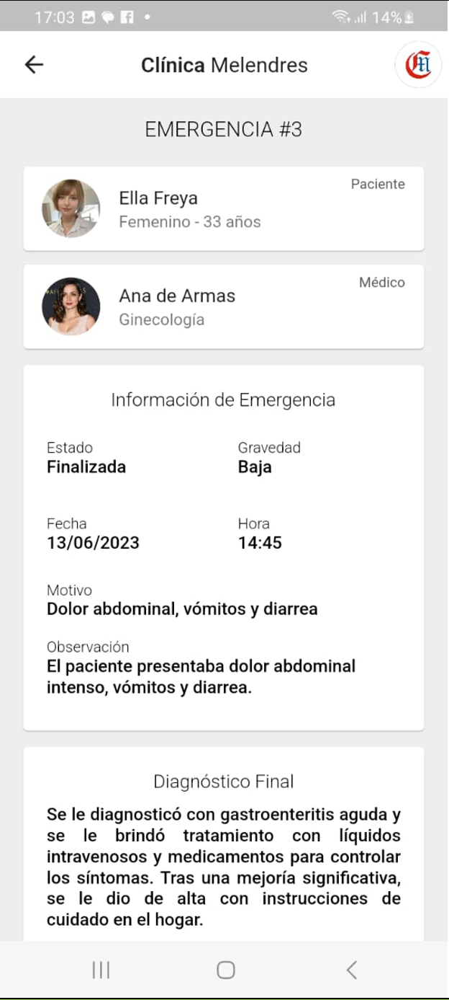
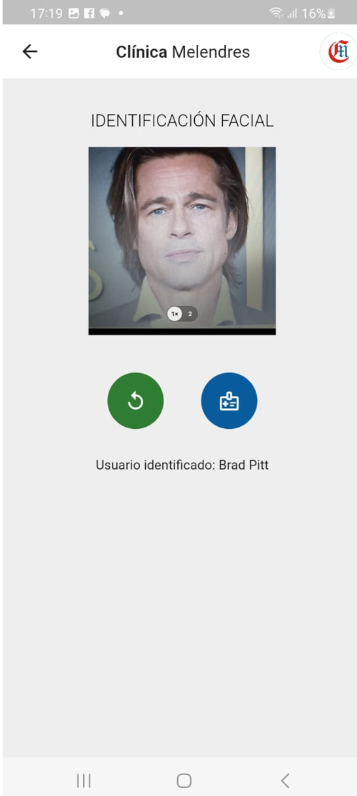
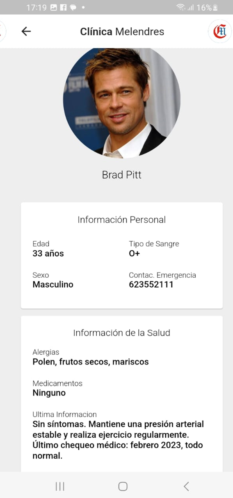
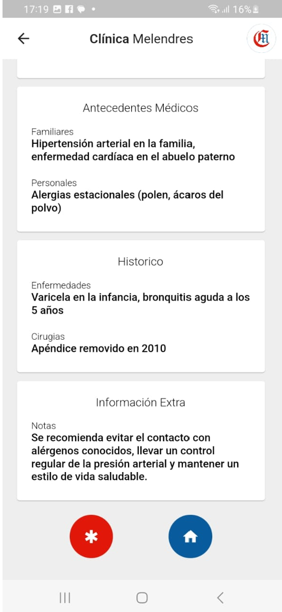

# Emergency Management Mobile Application

This is a mobile application developed with Flutter to manage information related to emergencies in a medical setting. The application provides various features to facilitate patient care and tracking in emergency situations.

## Key Features

- **Patient Management**: Allows for the registration and management of patient information in the emergency area.

- **Medical Staff Registration**: Manages information about medical personnel, including roles and privileges.

- **Facial Recognition for Patients**: Captures patient facial photos for quick identification and data retrieval.

- **Emergency Management**: Provides a module to manage incoming emergencies with detailed information about the emergency and the patient.

- **Electronic Health Records**: Manages the electronic health records of patients, both insured and new.

## Installation Requirements

- Flutter SDK: You need to have the Flutter SDK installed.
- Run `flutter pub get` to install the required dependencies.

## Usage Instructions

1. Clone or download the repository.
2. Open the project in a Flutter-compatible IDE.
3. Connect a mobile device or start an emulator.
4. Run `flutter run` to compile and launch the application on the device/emulator.

## Screenshots

Check out some screenshots of the platform below.

*Dashboard*

*User Management*

*User Form*

*Profile Screen*

*Emergency Information*

*Facial Identication*

*Medic History*

## Contributions

- Fork the repository.
- Create a new branch for your changes.
- Make necessary changes and commits.
- Submit a pull request with your proposed changes.
